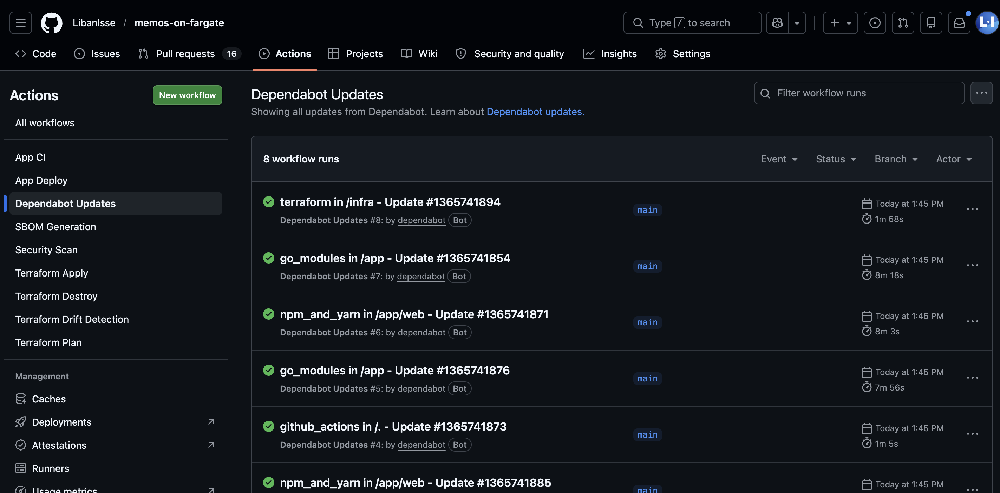
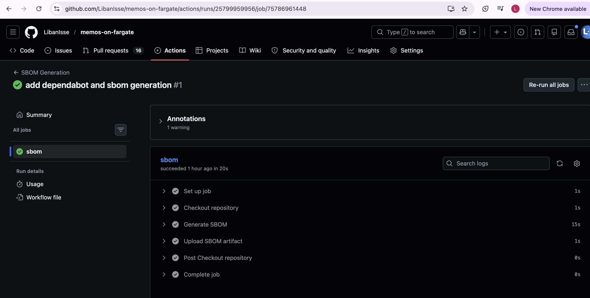

# ECS Memos Deployment

## Overview

This project deploys Memos, a lightweight note-taking app, on AWS ECS Fargate.

The application is packaged with Docker, served through an HTTPS Application Load Balancer, and managed with Terraform. GitHub Actions is used to automate the build, security checks, infrastructure changes and ECS deployment.

Deployment URL:

```text
https://tm.libanisse.co.uk
```

## App Demo

The demo below shows the application running through the HTTPS domain, successful GitHub Actions workflows, and the Slack deployment notification.


## Architecture
The diagram shows the full request flow from Route 53 and the Application Load Balancer into ECS Fargate tasks running in private subnets, as well as the CI/CD flow from GitHub Actions to ECR and ECS.


## Key Highlights

- Terraform-managed AWS infrastructure across networking, compute, load balancing, DNS, HTTPS and database services.
- ECS Fargate tasks run in private subnets behind a public Application Load Balancer.
- Custom Docker image built from the app folder and pushed to Amazon ECR.
- HTTPS enabled with ACM and Route 53.
- Remote Terraform state stored in S3 with native state locking.
- GitHub Actions CI/CD using OIDC instead of long-term AWS keys.
- Image scanning, Terraform scanning and secret scanning included in the workflows.
- Multi-AZ setup using two public and two private subnets.
- Dependabot is configured for dependency update PRs, and SBOM generation is included as a supply-chain security check.

The infrastructure includes a custom multi-AZ VPC, public/private subnets, ALB, ECS Fargate, ECR, ACM, Route 53, RDS, IAM, CloudWatch Logs, and an S3 remote backend with native state locking.

## Repository Structure

```
MEMOS-ON-FARGATE
├── app/               
│   ├── Dockerfile
│   └── .dockerignore
│
├── infra/
│   ├── backend.tf
│   ├── main.tf
│   ├── provider.tf
│   ├── variables.tf
│   ├── outputs.tf
│   ├── terraform.tfvars.example
│   └── modules/
│       ├── acm/
│       ├── alb/
│       ├── ecr/
│       ├── ecs/
│       ├── iam/
│       ├── rds/
│       ├── route53/
│       └── vpc/
│
├── .github/
│   ├── workflows/
│   │   ├── ci.yml
│   │   ├── deploy.yml
│   │   ├── drift-detection.yml
│   │   ├── sbom.yml
│   │   ├── security-checks.yml
│   │   ├── terraform-plan.yml
│   │   ├── terraform-apply.yml
│   │   └── terraform-destroy.yml
│   └── dependabot.yml
│
├── screenshots/
│   ├── app-demo.gif
│   ├── architecture-diagram.png
│   └── pipelines/
│
├── .gitignore
└── README.md
```

## Local Setup

### 1. Clone the repo

```bash
git clone https://github.com/LibanIsse/memos-on-fargate.git
cd memos-on-fargate
```

### 2. Build the Docker image

The Dockerfile is inside the app folder, so the Docker build context points there.

```bash
docker build -t memos-app:local ./app
```

### 3. Run the container

```bash
docker run -p 5230:5230 memos-app:local
```

### 4. Open the app locally

```text
http://localhost:5230
```

## Terraform State

Terraform state is stored remotely in an S3 backend.

State locking is also enabled using S3 native locking. This helps stop two Terraform runs from modifying the same state file at the same time.

The backend configuration is in:

```text
infra/backend.tf
```

## CI/CD Workflows

GitHub Actions is used for the build, security checks, Terraform plan, Terraform apply, Terraform destroy, and drift detection.

The workflows authenticate to AWS using GitHub OIDC instead of long-term AWS access keys.

Required GitHub repository variables and secrets:

```text
AWS_ROLE_ARN
AWS_REGION
ECR_REPOSITORY
TF_WORKING_DIR
APP_URL
SLACK_WEBHOOK_URL
```

## Workflows

### CI

```text
.github/workflows/ci.yml
```

Builds and checks the application. It installs dependencies, runs linting, builds the frontend, builds the Docker image, scans it with Grype, and pushes the image to ECR.

### Deploy

```text
.github/workflows/deploy.yml
```

Deploys the image pushed by the CI workflow from ECR to ECS. It updates the ECS task definition, deploys it to the ECS service, waits for the service to become stable, and runs a health check against the live app.

### Security Checks

```text
.github/workflows/security-checks.yml
```

Runs security checks across the project. This includes Checkov for Terraform, Trivy for filesystem scanning, and Gitleaks for secret scanning.

### Terraform Plan

```text
.github/workflows/terraform-plan.yml
```

Checks Terraform before changes are applied. It runs formatting checks, initialises Terraform, validates the code, and creates a plan.

### Terraform Apply

```text
.github/workflows/terraform-apply.yml
```
Applies Terraform changes to create or update the AWS infrastructure.

### Terraform Destroy

```text
.github/workflows/terraform-destroy.yml
```

Manual workflow used to destroy the infrastructure when it is no longer needed.

### Drift Detection

```text
.github/workflows/drift-detection.yml
```

Checks whether the live AWS infrastructure still matches the Terraform code. It runs on a schedule and sends a Slack notification if drift is found.

### Dependabot Updates

```text
.github/dependabot.yml
```

Checks for dependency updates and opens pull requests when newer versions are available. It is used to keep GitHub Actions, Terraform providers, Docker dependencies, and application packages up to date.

### SBOM Generation

```text
.github/workflows/sbom.yml
```

Generates a Software Bill of Materials for the project. It lists the packages and dependencies included in the application build to support supply chain security and vulnerability tracking.

## Screenshots

Screenshots of the deployed application and successful workflow runs.

<table>
  <tr>
    <td width="50%" align="center">
      <strong>Deployed Application</strong><br><br>
      
    </td>
    <td width="50%" align="center">
      <strong>CI Build and Push</strong><br><br>
      
    </td>
  </tr>
</table>

<table>
  <tr>
    <td width="50%" align="center">
      <strong>Terraform Plan</strong><br><br>
      
    </td>
    <td width="50%" align="center">
      <strong>Terraform Apply</strong><br><br>
      
    </td>
  </tr>
</table>

<table>
  <tr>
    <td width="50%" align="center">
      <strong>ECS Deploy</strong><br><br>
      
    </td>
    <td width="50%" align="center">
      <strong>Terraform Destroy</strong><br><br>
      
    </td>
  </tr>
</table>

<table>
  <tr>
    <td width="50%" align="center">
      <strong>Security Checks</strong><br><br>
      
    </td>
    <td width="50%" align="center">
      <strong>Drift Detection</strong><br><br>
      
    </td>
  </tr>
</table>

<table>
  <tr>
    <td width="50%" align="center">
      <strong>Dependabot Updates</strong><br><br>
      
    </td>
    <td width="50%" align="center">
      <strong>SBOM Generation</strong><br><br>
      
    </td>
  </tr>
</table>

## Security

The ECS tasks run in private subnets and do not have public IP addresses. Public traffic only reaches the application through the Application Load Balancer.

Security measures used in this project:

- HTTPS with ACM
- Route 53 DNS for the custom domain
- ECS access limited to traffic from the ALB security group
- GitHub Actions OIDC instead of long-term AWS access keys
- No hardcoded secrets in the repository
- Image, Terraform and secret scanning through CI/CD
- Dependabot is configured to raise dependency update pull requests.
- SBOM generation is included for software supply chain visibility.

## Issues I Worked Through

Some of the issues I had to debug during the project:

- ALB returned 503 Service Temporarily Unavailable when the target group had no healthy ECS tasks.
- ECS tasks were stopping because the container image tag and digest did not match what was available in ECR.
- The ALB health check path had to match the application health endpoint, otherwise ECS targets stayed unhealthy.
- Terraform state locking failed during concurrent CI/CD runs, showing why remote state locking matters.
- ECS deployments sometimes conflicted with Terraform because the task definition was being updated by CI/CD.

I debugged these by checking ECS service events, target group health checks, CloudWatch logs, ECR image tags, task definition revisions, GitHub Actions logs, IAM role settings and Terraform state behaviour.


## What I Learned

This project helped me understand how the main ECS deployment pieces fit together, from Docker builds to running the app on ECS Fargate behind an HTTPS load balancer.

Main takeaways:

- How ECS services, task definitions, target groups and ALB health checks work together.
- Why ECS tasks should run in private subnets behind a public Application Load Balancer.
- How to debug common ECS issues such as unhealthy targets, failed tasks and ALB 503 errors.
- How to organise Terraform using modules, remote state and state locking.
- How GitHub Actions can deploy to AWS securely using OIDC.
- Why commit SHA image tags make deployments easier to trace.
- How security checks, Dependabot, SBOM generation and drift detection improve the pipeline.

## Tech Stack

- **Cloud:** AWS ECS Fargate, ECR, ALB, VPC, Route 53, ACM, RDS, IAM, CloudWatch, S3
- **Infrastructure as Code:** Terraform
- **Containers:** Docker
- **CI/CD:** GitHub Actions
- **Security:** Github OIDC, Grype, Trivy, Checkov, Gitleaks, Dependabot, SBOM
- **Database:** Amazon RDS
- **Monitoring/Logs:** CloudWatch Logs
- **Notifications:** Slack webhook


## Future Improvements

- Add ECS blue/green deployments using AWS CodeDeploy for safer releases.
- Add ECS autoscaling based on CPU, memory, or ALB request count.
- Add CloudWatch alarms for ECS, ALB, and RDS.
- Add a separate staging environment before production.
- Add automated RDS backups and a clearer recovery strategy.
- Improve monitoring with structured logs, metrics, and tracing.
- Add more detailed application-level health checks.

